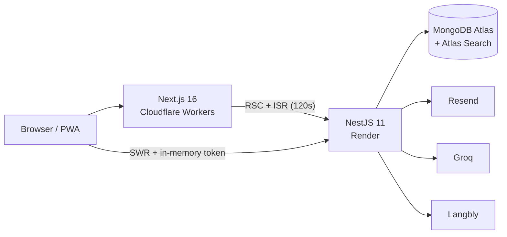

# Boi Pora (বই পড়া)

A full-stack digital reading platform: browse a book catalog, read chapters in
a focused, themeable reader, build a personal library with cross-device
progress sync, read offline as an installable PWA, and manage the catalog from
an admin workspace.

> **Screenshots** — _coming soon: home, reader (dark), library, admin._

## Architecture



Details in [`docs/architecture.md`](docs/architecture.md). Key decisions are
recorded as ADRs in [`docs/decisions/`](docs/decisions/); scaling plan in
[`docs/scaling.md`](docs/scaling.md).

```
boi-pora/
├── frontend/          # Next.js 16 — public site, reader, library, admin UI, PWA
├── backend/           # NestJS 11 API — auth, catalog, reading, reviews, AI, mail
├── docs/              # Architecture, ADRs, scaling seams
├── docker-compose.yml # Optional local MongoDB
└── package.json       # Root scripts (postinstall installs both apps)
```

## Features

- **Catalog & search** — Published books with metadata, Atlas Search-powered
  relevance + typo-tolerant search and autocomplete (regex fallback off-Atlas).
- **Reader** — Themes, typography settings, TOC, fullscreen, time-left-in-chapter,
  collapsing mobile header, scroll-position restore ("continue where you left off").
- **Library & progress** — Save books, track per-chapter progress and scroll
  position, synced across devices (and queued while offline).
- **Offline PWA** — Installable; download any saved book for full offline
  reading; offline fallback page; user-prompted service worker updates.
- **Accounts & sessions** — Short-lived access tokens in memory + rotating
  HttpOnly refresh cookies with reuse detection; devices UI to revoke sessions;
  password reset email via Resend.
- **AI extras** — Optional Groq chapter summaries (cached) and Langbly
  press-and-hold inline translation.
- **Admin** — Role-gated workspace for books, chapters (auto word count),
  users, and review moderation.
- **SEO** — RSC + ISR public pages, dynamic sitemap, robots, OG images, JSON-LD.

## Quick start

Prerequisites: **Node.js 20+** and **MongoDB 6+** (local, Docker, or Atlas).

```bash
# 1. MongoDB (skip if you have one)
docker compose up -d

# 2. Everything else
npm install                                  # installs root + frontend + backend
cp backend/.env.example backend/.env         # then set ADMIN_SEED_PASSWORD at minimum
npm run seed -- --with-fixtures              # admin + 20 demo books + demo user
```

Then in two terminals:

```bash
npm run dev:api    # NestJS on http://localhost:4000
npm run dev        # Next.js on http://localhost:3000
```

The seed prints credentials: admin from `ADMIN_SEED_PASSWORD`, demo user
`demo@boipora.com` (password from `DEMO_SEED_PASSWORD`, defaults shown in the
seed output). Plain `npm run seed` creates only the admin.

## Environment variables

### Backend (`backend/.env`)

| Variable | Required | Purpose |
|----------|----------|---------|
| `MONGODB_URI` | yes | Mongo connection string |
| `JWT_SECRET` | yes | Access-token signing secret (32+ chars in prod) |
| `CORS_ORIGIN` | yes | Allowed origin(s), comma-separated |
| `ADMIN_SEED_PASSWORD` | for seed | Seeded admin password (no default — seed refuses) |
| `PORT` | no | API port (default `4000`) |
| `COOKIE_SAMESITE` | no | `lax` (same-site deploys) or `none` (cross-site, e.g. pages.dev + onrender.com) |
| `ADMIN_SEED_EMAIL` | no | Seed admin email (default `admin@boipora.com`) |
| `DEMO_SEED_PASSWORD` | no | Demo user password for `--with-fixtures` |
| `RESEND_API_KEY` | no | Password reset + contact emails (skipped in dev without it) |
| `MAIL_FROM` / `CONTACT_TO` | no | Email sender / contact-form recipient |
| `GROQ_API_KEY` / `GROQ_MODEL` | no | AI chapter summaries |
| `LANGBLY_API_KEY` / `LANGBLY_API_BASE_URL` | no | Inline translation |

### Frontend (`frontend/.env.local`)

| Variable | Required | Purpose |
|----------|----------|---------|
| `NEXT_PUBLIC_API_URL` | no | API base URL (default `http://localhost:4000`) |
| `NEXT_PUBLIC_SITE_URL` | no | Canonical site URL for OG/sitemap (default `http://localhost:3000`; set to the production domain at build time) |

## Testing

```bash
# Backend — unit + integration (mongodb-memory-server, no DB needed)
cd backend
npm test
npm run test:e2e

# Frontend — typecheck, lint, Playwright E2E (needs both apps running)
cd frontend
npx tsc --noEmit && npm run lint
npm run test:e2e
```

CI (`.github/workflows/ci.yml`) runs lint, typecheck, backend unit +
integration tests, and gitleaks secret scanning on every push/PR.

## Deployment

- **Frontend → Cloudflare Workers** via `@opennextjs/cloudflare`: from
  `frontend/`, `npm run deploy` (see `wrangler.jsonc`). Set
  `NEXT_PUBLIC_API_URL` and `NEXT_PUBLIC_SITE_URL` for the build.
- **Backend → Render**: build `npm run build`, start `npm run start:prod`. Set
  `MONGODB_URI`, `JWT_SECRET`, `CORS_ORIGIN` (your frontend URL), and
  `COOKIE_SAMESITE=none` for cross-site cookie delivery. A scheduled ping to
  `GET /health` keeps the free instance warm.
- **MongoDB Atlas**: create the database, then add the **Atlas Search index**
  on `books` (dynamic mapping is sufficient; used by search + autocomplete —
  without it the API silently uses the regex fallback).

## API overview

Base path **`/api/v1`** — global JWT guard, `@Public()` for open routes,
throttled, validated DTOs.

| Area | Endpoints (selected) |
|------|----------------------|
| Auth | `POST /auth/register · /auth/login · /auth/refresh · /auth/logout · /auth/logout-all`, `GET /auth/me · /auth/sessions`, `DELETE /auth/sessions/:id`, `PUT /auth/me` |
| Books | `GET /books · /books/:id · /books/slug/:slug · /books/search · /books/autocomplete` (public, published-only) |
| Chapters | `GET /chapters/book/:bookId · /chapters/book/:bookId/:chapterId` (public), `POST /chapters/book/:bookId/:chapterId/summary` (Groq, cached) |
| Reading | `GET/POST /reading/progress` (incl. `scrollPercent`) |
| Library / Reviews | Authenticated CRUD; reviews update book rating aggregates |
| Translate / Contact | `POST /translate`, `POST /contact` (throttled) |
| Admin | Role-gated users, books, chapters, moderation |

## Tech stack

| Area | Choices |
|------|---------|
| Frontend | Next.js 16 (App Router, RSC + ISR), React 19, Tailwind CSS 4, SWR, Playwright |
| Backend | NestJS 11, Mongoose, Passport JWT, class-validator, Jest + supertest |
| Data | MongoDB Atlas (+ Atlas Search), TTL-indexed sessions |
| Platform | Cloudflare Workers (`@opennextjs/cloudflare`), Render, GitHub Actions |
| External | Resend (email), Groq (summaries), Langbly (translation) |

---

**Boi Pora** — built for reading, and for learning how to build well.
