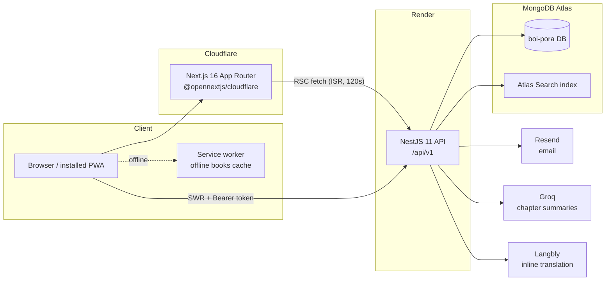

# Architecture

## Frontend (`frontend/`)

- **Next.js 16 App Router**, deployed to Cloudflare Workers via
  `@opennextjs/cloudflare` (`wrangler.jsonc`).
- **Public pages are RSC + ISR** (`revalidate = 120`): home, explore, book
  detail (`/[category]/[slug]`), reader (`/read/[bookId]/[chapterId]`). Server
  fetch helpers live in `lib/server-fetch.ts` / `lib/reader-page-fetch.ts`.
- **Personalized UI is client-side**: SWR hooks (`lib/hooks/*`) call the API
  through `lib/api.ts`, which keeps the access token **in memory**, performs
  single-flight silent refresh against the `HttpOnly` refresh cookie, and
  retries the failed request once.
- **Route gating**: `middleware.ts` redirects unauthenticated visitors away
  from `/library`, `/profile`, `/admin`, … using a non-sensitive hint cookie.
- **SEO**: `app/sitemap.ts` (dynamic from the API), `app/robots.ts`,
  `app/opengraph-image.tsx`, per-page `generateMetadata`, JSON-LD on book and
  chapter pages.
- **PWA**: `public/sw.js` (hand-rolled, see ADR 005), `public/site.webmanifest`,
  registration + update prompt in `app/components/shared/PwaRegistrar.tsx`,
  per-book offline downloads in `lib/offline-books.ts`, offline fallback at
  `app/offline/`.

## Backend (`backend/`)

- **NestJS 11 + Mongoose**, global `ValidationPipe` (whitelist) and sanitize
  pipe, `helmet`, `cookie-parser`, global throttling with per-route
  `@Throttle` overrides, global JWT guard with `@Public()` escape hatch and
  `RolesGuard` for admin routes.
- **Modules**: `auth` (sessions, rotation, reuse detection — ADR 002), `users`,
  `books` (Atlas Search + fallback — ADR 006), `chapters` (auto word count),
  `reading` (progress incl. `scrollPercent`), `library`, `reviews` (rating
  aggregates), `ai` (Groq summaries, cached per chapter), `translate`
  (Langbly), `mail` (Resend), `contact`.
- **Schemas** in `src/schemas/` with compound unique indexes for integrity
  (ADR 004). Sessions expire via TTL index.

## Data flow examples

**Public book page** — Cloudflare serves ISR HTML; at most one server-side
fetch per 120 s window per page hits Render.

**Authenticated request** — SWR → `api.ts` adds in-memory Bearer token → 401
→ single-flight `POST /auth/refresh` (cookie) → retry once → on refresh
failure, auth state clears.

**Offline chapter** — SW navigation fetch fails → serves precached `/offline`
shell → shell reads the original URL, loads the chapter JSON from the
offline-books cache, renders it client-side.

## Testing & CI

- Backend: Jest unit tests (`*.spec.ts`) + supertest integration tests against
  `mongodb-memory-server` (`backend/test/`).
- Frontend: Playwright E2E (`frontend/e2e/`) covering the reader golden path
  and the admin publish flow.
- GitHub Actions (`.github/workflows/ci.yml`): lint + typecheck + tests for
  both packages, plus gitleaks secret scanning.
